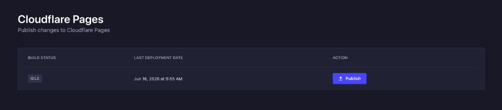

# Strapi plugin cloudflare-pages

[![NPM version][npm-image]][npm-url]
[![PR Welcome][npm-downloads-image]][npm-downloads-url]

This is a plugin for [Strapi](https://github.com/strapi/strapi) headless CMS. It lets you trigger Cloudflare Workers/Pages builds from Strapi and monitor their status from the admin panel.

**The main branch is compatible with Strapi v4. If you are looking for the version compatible with Strapi v3 please switch to the [v3 branch](https://github.com/sarhugo/strapi-plugin-cloudflare-pages/tree/v3).**

## Introduction



When using Strapi as a headless CMS for a statically built website you need a way to trigger the site to rebuild when content has been updated. The typical approach is to setup a Strapi managed webhook to trigger a build whenever content changes. This approach has it's issues. For example when making many changes to content, builds are triggered multiple times and deployments can fail due to the site being deployed concurrently. Also you don't have a way to filter entity types for webhooks, so in case you handle a contact form via content creation you will be triggering a new build every time a new message is received.

This plugin tackles the publishing flow a different way. The site administrators can take their time and make many changes and once the content update is complete they can trigger a single build.

You can configure several instances in order to manage preview builds, not just production one.

This plugin takes the approach from the one implemented to trigger builds at github CI/CD, available [here](https://github.com/phantomstudios/strapi-plugin-github-publish).

### What's new in v0.6.0

- **Build status monitoring** — polls the [Cloudflare Workers Builds API](https://developers.cloudflare.com/workers/ci-cd/builds/api-reference/) and shows the current build state (`IDLE`, `QUEUED`, `INITIALIZING`, `RUNNING`, etc.)
- **Last deployment date** — displays when the last successful deployment finished, even while a new build is running
- **Deploy hook details** — shows branch and trigger context (e.g. `master-cloudflare (deploy hook)`) instead of a misleading `@ -` placeholder when no commit is available
- **Improved publish flow** — clearer errors when the deployment hook URL is missing or the trigger request fails
- **Updated admin UI** — table layout with build status, last deployment date, and publish action

## Installation

Install this plugin with npm or yarn.

With npm:

```bash
npm install strapi-plugin-cloudflare-pages
```

With yarn:

```bash
yarn add strapi-plugin-cloudflare-pages
```

## Configuration

Generate a config file at `config/plugins.js` or `config/development/plugins.js` etc...

### Deployment hook only

The minimum configuration triggers a build via a [Cloudflare Deploy Hook](https://developers.cloudflare.com/workers/ci-cd/builds/deploy-hooks/):

```javascript
module.exports = ({ env }) => ({
  'cloudflare-pages': {
    enabled: true,
    config: {
      instances: [
        {
          name: "production website",
          hook_url: process.env.CLOUDFLARE_PAGES_DEPLOYMENT_HOOK_URL,
        },
      ],
    },
  },
});
```

Set the hook URL in your environment:

```bash
CLOUDFLARE_PAGES_DEPLOYMENT_HOOK_URL=https://api.cloudflare.com/client/v4/pages/webhooks/deploy_hooks/...
```

### With build status monitoring

To enable live build status and last deployment date in the admin UI, add a `build_monitor` block per instance:

```javascript
module.exports = ({ env }) => ({
  'cloudflare-pages': {
    enabled: true,
    config: {
      instances: [
        {
          name: "All",
          hook_url: process.env.CLOUDFLARE_PAGES_DEPLOYMENT_HOOK_URL,
          build_monitor: {
            account_id: "<cloudflare-account-id>",
            worker_name: "my-worker",
            api_token_env: "CLOUDFLARE_BUILDS_API_TOKEN",
          },
        },
      ],
    },
  },
});
```

| Field | Description |
| --- | --- |
| `hook_url` | Deploy Hook URL. A `POST` request to this URL triggers a build. |
| `build_monitor.account_id` | Cloudflare account ID. |
| `build_monitor.worker_name` | Worker script name (the `id` from the Workers Scripts API). |
| `build_monitor.worker_tag` | Optional. Worker tag UUID. If omitted, it is resolved automatically from `worker_name`. |
| `build_monitor.api_token_env` | Optional. Env var name for the Builds API token. Defaults to `CLOUDFLARE_BUILDS_API_TOKEN`. |

Set the API token in your environment:

```bash
CLOUDFLARE_BUILDS_API_TOKEN=<your-api-token>
```

The API token needs **Workers Builds Configuration: Edit** and **Workers Scripts: Read** permissions. See the [Builds API reference](https://developers.cloudflare.com/workers/ci-cd/builds/api-reference/) for details.

### Multiple instances

```javascript
instances: [
  {
    name: "production website",
    hook_url: process.env.CLOUDFLARE_PAGES_PRODUCTION_HOOK_URL,
    build_monitor: {
      account_id: "<account-id>",
      worker_name: "my-worker-production",
    },
  },
  {
    name: "preview website",
    hook_url: process.env.CLOUDFLARE_PAGES_PREVIEW_HOOK_URL,
    build_monitor: {
      account_id: "<account-id>",
      worker_name: "my-worker-preview",
    },
  },
],
```

## Use the Plugin

When the plugin has been installed correctly, open **Cloudflare Pages** under Plugins in the Strapi sidebar.

The admin page shows:

- **Build status** — current state of the active build, or `IDLE` when nothing is running. During an active build, branch and trigger details are shown below the status badge.
- **Last deployment date** — timestamp of the most recent successful deployment.
- **Publish** — triggers the configured Deploy Hook. The button is disabled while a build is in progress.

Build status is polled automatically every 5 seconds when monitoring is configured.

> **Note:** Builds triggered via Deploy Hooks do not include a git commit hash in the Cloudflare API response. The UI shows the branch name with `(deploy hook)` instead of `@ -`. Commit details appear for git-triggered builds (e.g. push to the connected repository).

[npm-image]: https://img.shields.io/npm/v/strapi-plugin-cloudflare-pages.svg?style=flat-square&logo=react
[npm-url]: https://npmjs.org/package/strapi-plugin-cloudflare-pages
[npm-downloads-image]: https://img.shields.io/npm/dm/strapi-plugin-cloudflare-pages.svg
[npm-downloads-url]: https://npmcharts.com/compare/strapi-plugin-cloudflare-pages?minimal=true
